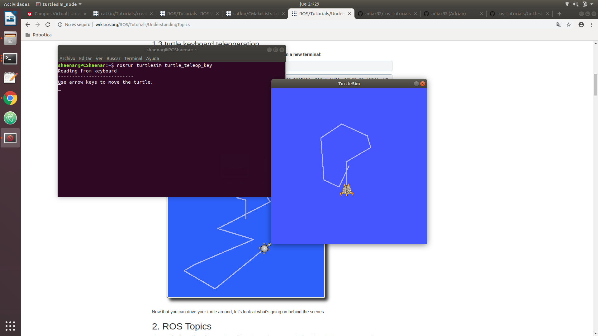
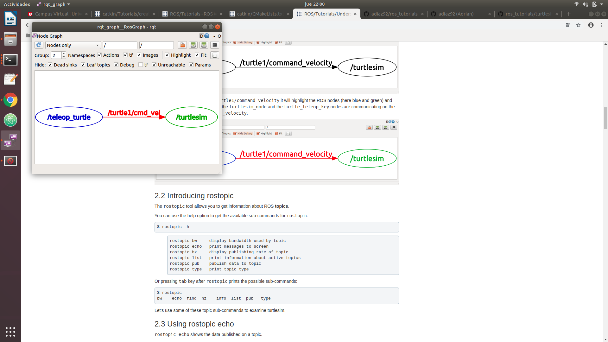

# ros_tutorials

# ros_tutorials
Homework exercise 1.3, ROS TUTORIALS

# Tutorial 5
Here is the output of the turtlesim:


# Tutorial 6

Some sample screenshots I got doing tutorial 6:







# Tutorial 7
Calling services: ```rosservice list ```


Calling services: rosservice call /spawn 2 2 0.2 ""


Changing parameters:
```
rosparam set /background_r 150
rosparam set /background_g 86
rosparam set /background_b 255
```


# Tutorial 8
Wall Crash Warning with rqt console:


Launching a mimic launch:


Launching a roslaunch mimic circular movement:


Using rqt tools:


